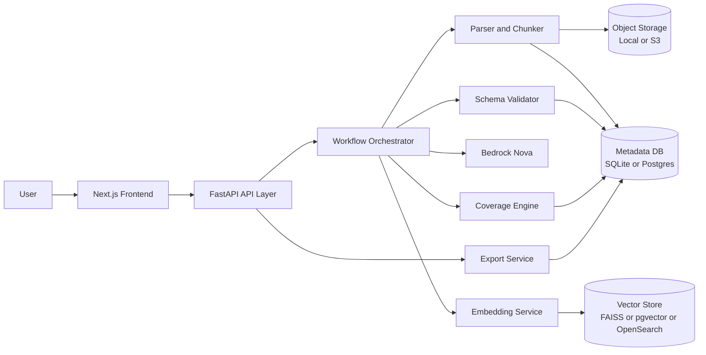
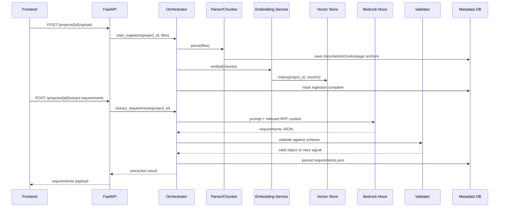
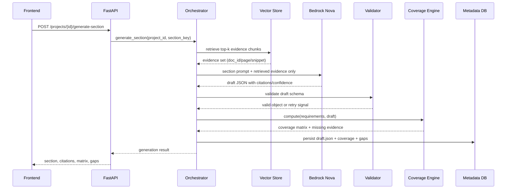
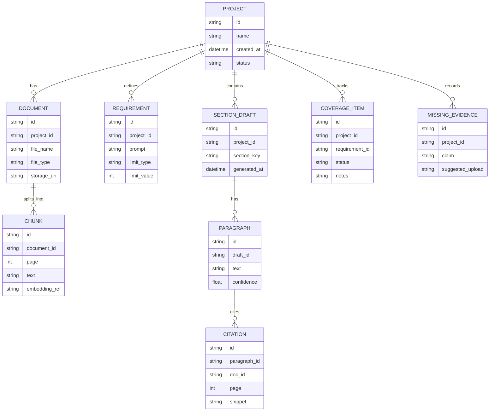
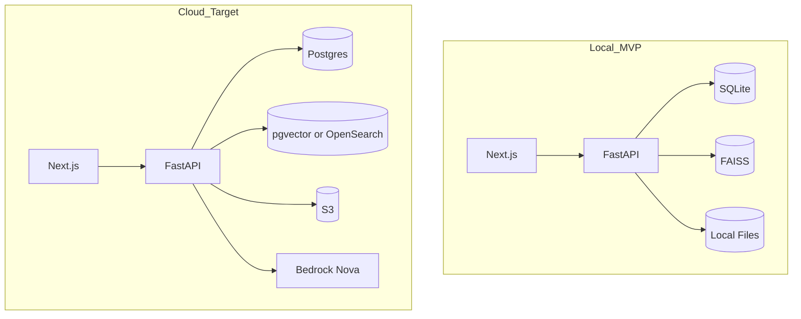

# Nebula Architecture Plan

## 1) Purpose
Nebula is an evidence-backed drafting system that turns an RFP plus nonprofit documents into:
- `requirements.json`
- cited section drafts (`draft.json`)
- coverage matrix (`met | partial | missing`)
- `missing_evidence[]`

This architecture is optimized for a 1-month MVP build with reliable demo behavior.

## 2) Architecture Principles
- Citation-first generation: every claim must map to retrievable evidence.
- Structured outputs only: model responses must validate against JSON schemas.
- Deterministic demo behavior: conservative model settings and explicit retries.
- Replaceable infrastructure: local defaults now, cloud-ready interfaces later.
- Minimal coupling: parsing, retrieval, generation, validation, and export are separate modules.

## 3) High-Level System Design

## 4) Component Responsibilities
| Component | Responsibility | Inputs | Outputs |
|---|---|---|---|
| Frontend (Next.js) | Upload, trigger workflows, display results, export downloads | user actions | API requests |
| API Layer (FastAPI) | Auth/session boundary, endpoint routing, response shaping | HTTP requests | workflow commands/results |
| Workflow Orchestrator | Coordinates parse/retrieve/generate/validate pipeline | project + section commands | normalized artifacts |
| Parser and Chunker | Extract text/page anchors, chunk documents | uploaded files | chunks + metadata |
| Embedding Service | Convert chunks to vectors | chunks | embeddings |
| Vector Store | Retrieval by semantic similarity + filters | query + project scope | ranked evidence chunks |
| Bedrock Nova | Requirements extraction + drafting with strict prompts | limited context payload | JSON model output |
| Schema Validator | Enforce output contracts; repair once when invalid | model JSON | valid typed objects or error |
| Coverage Engine | Map requirements to evidence-backed draft support | requirements + draft | coverage matrix + gaps |
| Export Service | Build JSON/Markdown export packages | stored artifacts | downloadable files |
| Metadata DB | Source of truth for project state and artifacts | all pipeline writes | queryable records |
| Object Storage | Durable raw document storage | uploads | file references |

## 5) Core Workflows

### 5.1 Ingestion and Requirements Extraction

### 5.2 Cited Section Generation and Coverage Update

## 6) Data Model (Logical)

## 7) API Surface (MVP)
- `POST /projects`
- `POST /projects/{id}/upload`
- `POST /projects/{id}/extract-requirements`
- `POST /projects/{id}/generate-section`
- `GET /projects/{id}/export`

Contracts for `requirements.json`, `draft.json`, and coverage matrix follow `CONTRIBUTING.md`.

## 7.1) Runtime Intelligence Call Path (Current Submission Path)

Current backend runtime path (Nova on Bedrock):
- `POST /projects/{project_id}/extract-requirements`
  - endpoint: `backend/app/main.py` (`extract_requirements`)
  - orchestrator: `backend/app/nova_runtime.py` (`BedrockNovaOrchestrator.extract_requirements`)
  - model ID: `BEDROCK_MODEL_ID=us.amazon.nova-pro-v1:0`
  - artifact source tag: `nova-agents-v1`
- `POST /projects/{project_id}/generate-section`
  - endpoint: `backend/app/main.py` (`generate_section`)
  - orchestrator: `backend/app/nova_runtime.py` (`BedrockNovaOrchestrator.generate_section`)
  - model ID: `BEDROCK_MODEL_ID=us.amazon.nova-pro-v1:0`
  - artifact source tag: `nova-agents-v1`
- `POST /projects/{project_id}/coverage`
  - endpoint: `backend/app/main.py` (`compute_coverage`)
  - orchestrator: `backend/app/nova_runtime.py` (`BedrockNovaOrchestrator.compute_coverage`)
  - model ID: `BEDROCK_LITE_MODEL_ID=us.amazon.nova-lite-v1:0`
  - artifact source tag: `nova-agents-v1`

Execution flow:
- FastAPI endpoint -> Nova orchestrator stage -> Bedrock `converse` -> schema validation/repair -> artifact persistence
- If Nova invocation fails, endpoint returns `502` with explicit runtime failure details.

## 7.2) Agentic Orchestration Pilot (Feature-Flagged)

Pilot scope:
- workflow stage: section generation planning + verification refinement
- endpoint: `POST /projects/{project_id}/generate-section`
- feature flag: `ENABLE_AGENTIC_ORCHESTRATION_PILOT` (default `false`)

Pilot flow when enabled:
1. Planner stage (`BedrockNovaOrchestrator.plan_section_generation`) chooses retrieval `top_k` and retry policy.
2. Writer stage generates draft from planned retrieval set.
3. Verification stage checks `missing_evidence`; if present, orchestrator expands retrieval window and retries once.
4. Best validated draft is persisted with unchanged API contract and citation schema requirements.

Tradeoffs:
- Determinism preserved by default (`false`) and bounded retry policy (single retry, bounded `top_k`).
- Autonomy introduced only in controlled planning/refinement decisions.
- Citation grounding requirements are unchanged: draft schema still requires explicit citation objects and validation gate remains mandatory.

## 8) Validation and Error Strategy
- Every model response is schema-validated before persistence.
- On validation failure: one structured repair attempt, then explicit error.
- Citation guardrail: reject citations that do not match retrieved evidence IDs/pages.
- Determinism defaults: low temperature, bounded context, bounded token limits.

## 9) Security and Privacy Baseline
- No secrets in repository.
- Encrypt data in transit; encrypt storage where available.
- Limit model payloads to required text chunks only.
- Redact sensitive values in logs; never log full raw documents.
- Role-based access and tenant scoping at API boundary.

## 10) Deployment Topology

## 11) Build Order (Architecture-First)
1. Implement ingestion, chunking, and indexing pipeline.
2. Implement requirements extraction with strict schema validation.
3. Implement cited drafting with retrieval-constrained prompts.
4. Implement coverage and missing evidence computation.
5. Implement export and demo-safe UX states.
