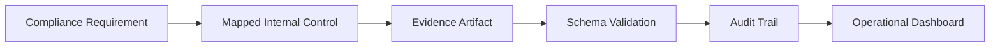
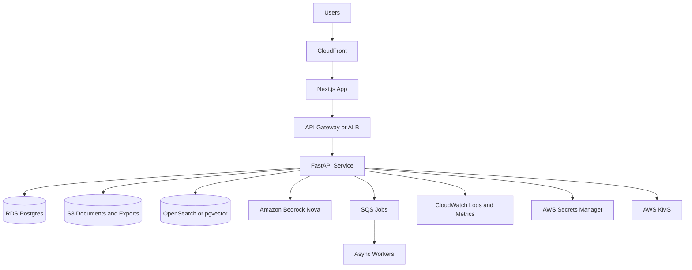

# GrantSmith Alignment to AWS Well-Architected and CAF

## Purpose
This document maps GrantSmith architecture and delivery plans to:
- AWS Well-Architected Framework (6 pillars)
- AWS Cloud Adoption Framework (CAF perspectives)

Reference docs:
- `ARCHITECTURE.md`
- `DEVELOPMENT_PLAN.md`
- `CONTRIBUTING.md`

## Scope
- Current state: 1-month MVP, local-first deployment with cloud-ready design.
- Target state: production deployment on AWS for multi-tenant compliance workloads.

## Live Alignment Status
<!-- AUTO-GEN:AWS_STATUS:START -->
- Last updated: `2026-02-07`

| Pillar | Status | Next Control |
|---|---|---|
| Operational Excellence | Partial | Add CI checks, runbooks, and release checklist |
| Security | Partial | Define IAM model, data classification, and key policy |
| Reliability | Partial | Define backups, restore test, and async job strategy |
| Performance Efficiency | Not started | Add load profile and scaling plan |
| Cost Optimization | Not started | Add token budget guardrails and cost visibility |
| Sustainability | Not started | Define retention and right-sizing practices |
<!-- AUTO-GEN:AWS_STATUS:END -->

## Well-Architected Mapping

| Pillar | GrantSmith Design Alignment | Required Controls (Production) | MVP Status |
|---|---|---|---|
| Operational Excellence | Orchestrated workflows for ingestion, extraction, drafting, validation, export. | Runbooks, deployment pipelines, change tracking, SLOs, incident playbooks. | Partial |
| Security | Tenant scoping, citation-grounded prompts, minimal payload to model, no secrets in repo. | IAM least privilege, KMS encryption, WAF, secrets manager, audit logging, threat detection. | Partial |
| Reliability | Schema validation, retry-on-invalid JSON, explicit error paths, deterministic settings. | Multi-AZ database, backups/restore drills, queue-based async workers, health checks, DR plan. | Partial |
| Performance Efficiency | Retrieval-constrained context and modular services with replaceable stores. | Load testing, autoscaling, caching strategy, async processing for heavy jobs, profiling. | Not started |
| Cost Optimization | Controlled token usage via bounded prompts and structured outputs. | Per-tenant cost attribution, budget alarms, storage lifecycle policies, model cost guardrails. | Not started |
| Sustainability | Efficient retrieval-first architecture reduces excess model calls. | Right-sizing, storage retention policy, workload scheduling, measured resource efficiency. | Not started |

## CAF Perspective Mapping

| CAF Perspective | GrantSmith Focus | Primary Owner | Core Artifacts |
|---|---|---|---|
| Business | Compliance outcomes, trust, faster submission readiness. | Product/Founder | KPI set, value hypothesis, customer success metrics |
| People | Trustee/admin/reviewer workflows; human-in-the-loop approvals. | Product + Ops | Role definitions, RACI, onboarding guide |
| Governance | Policy-driven controls, evidence traceability, audit readiness. | Compliance Lead | Control catalog, evidence matrix, policy set |
| Platform | FastAPI/Next.js architecture, vector retrieval, Bedrock integration. | Engineering | `ARCHITECTURE.md`, infra modules, environment matrix |
| Security | Data protection, tenant isolation, RBAC, logging boundaries. | Security Lead | Threat model, IAM model, data classification, key policy |
| Operations | Monitoring, alerts, incident response, backup and restore. | SRE/Engineering | Runbooks, SLO/SLI, observability dashboards, DR procedures |

## Traceability: Requirement to Evidence to Control

## AWS Target Architecture (Production Direction)

## Gap Checklist to Reach Well-Architected Baseline
- Define workload criticality, RTO/RPO, and availability target.
- Implement IAM least privilege and tenant-aware authorization policy.
- Add encryption-at-rest and key rotation policy for all data stores.
- Add centralized structured logs with PII redaction policy.
- Add queue-based async ingestion/generation workers for reliability.
- Add backups, restore test routine, and incident response runbook.
- Add load test + cost test for typical and peak RFP workloads.
- Add budget alarms and per-tenant usage metering.

## Month-1 Implementation Tie-In
Link these items to `DEVELOPMENT_PLAN.md` week plan:
- Week 1: Platform baseline and secure configuration foundations.
- Week 2: Governance and schema enforcement for requirements extraction.
- Week 3: Reliability and traceability in cited drafting and coverage.
- Week 4: Operational readiness, exports, runbooks, and demo hardening.

## Acceptance Criteria for “AWS-Aligned MVP”
- Every generated claim has a citation to indexed evidence.
- All model outputs pass schema validation or fail with explicit error.
- Tenant/project boundaries are enforced in API and retrieval filters.
- Logs exclude raw document bodies and include request correlation IDs.
- Backup and restore procedure is documented and tested at least once.
