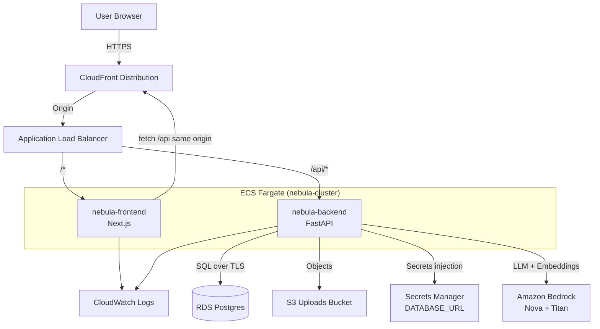

# Nebula

Nebula is an Amazon Nova-powered grant drafting workspace.  
It turns source documents into cited draft sections, requirement coverage, and exportable submission artifacts.

## What It Does
- Extracts requirements from RFP-like documents
- Generates citation-backed draft sections
- Computes coverage (`met` / `partial` / `missing`)
- Flags missing evidence
- Supports citation click-through evidence inspection and grouped missing-evidence guidance
- Exports JSON + Markdown bundles

## Stack
- Frontend: Next.js
- Backend: FastAPI
- Storage (local dev): SQLite + local filesystem
- Storage (prod): RDS Postgres + S3
- Models: Amazon Nova + Titan Embeddings via Bedrock

## Deployed AWS Architecture


## Quick Start
1. Copy env files:
```bash
cp backend/.env.example backend/.env
cp frontend/.env.example frontend/.env.local
```
2. Run with Docker:
```bash
docker compose up --build
```
3. Open:
- Frontend: `http://localhost:3000`
- Backend: `http://localhost:8000`
- Backend docs: `http://localhost:8000/docs`

## AWS Deploy Checklist
- Workflow: `.github/workflows/deploy-aws.yml`
- Prerequisites and secrets: `docs/wiki/AWS-Production-Deployment-Checklist.md`
- Readiness check script: `scripts/aws/check_deploy_readiness.sh`

## Core API
- `POST /projects`
- `POST /projects/{id}/upload`
- `POST /projects/{id}/reindex`
- `POST /projects/{id}/extract-requirements`
- `POST /projects/{id}/generate-section`
- `POST /projects/{id}/generate-full-draft`
- `POST /projects/{id}/coverage`
- `GET /projects/{id}/export`

## Workspace Quality Workflow
After each run, review these workspace panels before final export:
- `Quality Signals`: parse quality counts, extraction mode, candidate dedupe metrics, and RFP ambiguity warnings.
- `Unresolved Coverage Gaps`: requirement-level `partial` / `missing` items with coverage notes and evidence refs.
- `Missing Evidence`: grouped upload guidance for unresolved claims.

Recommended flow:
1. Upload clean, text-searchable source files.
2. Run generate and review quality diagnostics.
3. Address flagged gaps with targeted uploads.
4. Re-run until unresolved gaps are cleared.
5. Export markdown/json bundle.

## Notes
- Current parser registry supports `.txt`, `.md`, `.csv`, `.json`, `.yaml`, `.yml`, `.xml`, `.html`, plus native `.pdf`, `.docx`, and `.rtf`.
- Embedding modes: `EMBEDDING_MODE=hash|bedrock|hybrid` with `BEDROCK_EMBEDDING_MODEL_ID` for Bedrock-backed vectors.
- Deterministic requirements extraction uses ordered passes (`explicit_tag` -> `structured_outline` -> `inline_indicator` -> `fallback_question`) and stores question-level provenance.
- If embedding settings change after indexing, API responses may include `warnings` with `code: embedding_dim_drift`; re-index documents to resolve.
